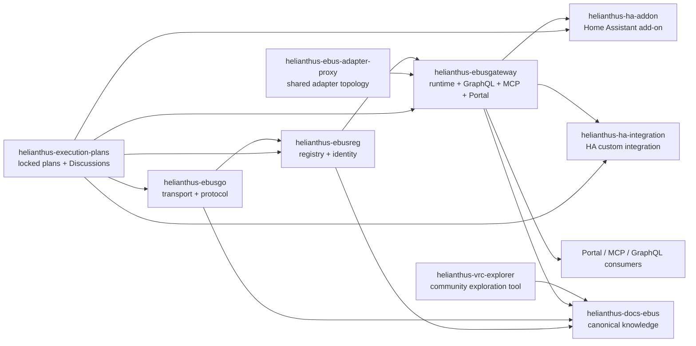
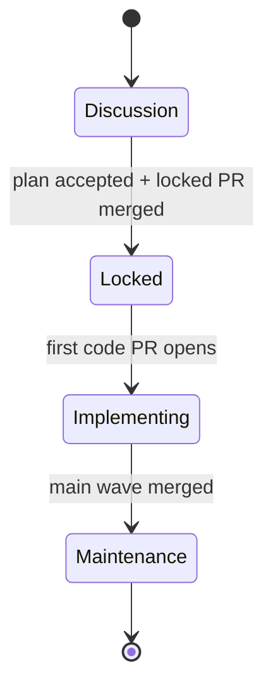
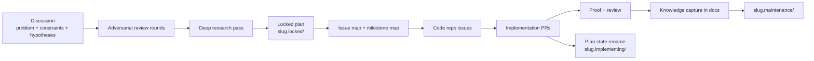
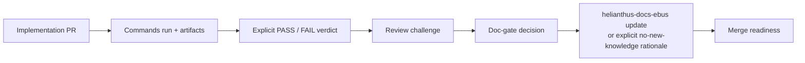

# Helianthus Org-Wide Agent Guide

This file applies to human contributors, coding agents, review agents, and
research agents working in Project Helianthus repositories.

The intent is simple:

- plan non-trivial work before coding it
- keep claims provable and falsifiable
- move reusable knowledge into the docs repo
- keep repo responsibilities explicit

## Repository Map

| Repository | Role |
| --- | --- |
| `helianthus-ebusgo` | eBUS transport, framing, protocol primitives, low-level reusable code |
| `helianthus-ebusreg` | registry, identity, projection model, semantic composition |
| `helianthus-ebusgateway` | runtime, GraphQL, MCP, Portal, FSMs, scans, HTTP edge |
| `helianthus-ha-addon` | Home Assistant add-on packaging and operator entry point |
| `helianthus-ha-integration` | Home Assistant custom integration consuming GraphQL |
| `helianthus-ebus-adapter-proxy` | adapter fan-out and shared topology helper |
| `helianthus-vrc-explorer` | regulator-focused exploration tool useful inside and outside Helianthus |
| `helianthus-docs-ebus` | canonical public knowledge for architecture, APIs, protocol behavior, and operations |
| `helianthus-execution-plans` | canonical locked execution plans and the official Discussions venue for adversarial planning |

## Repo Dependency Map

## When A Locked Plan Is Mandatory

Work must start in `helianthus-execution-plans` when it is:

- cross-repo
- milestone-driven
- architecture-affecting
- protocol-affecting
- API-affecting

Do not start coding those workstreams in a code repository before a locked plan
exists.

Bugfixes or small one-repo changes may start directly in the target repo if they
do not need a cross-repo execution plan.

## Planning Venue

`helianthus-execution-plans` Discussions are the official venue for:

- adversarial planning
- multi-agent attacks and defenses
- deep research passes
- plan hardening before lock

Discussion comments should be clearly marked when relevant:

- `ATTACK`
- `DEFENSE`
- `RESEARCH`
- `REVISION`
- `LOCK`

## Plan Lifecycle

Discussion is the incubation stage. The repository stores plans only from
`locked` onward.

## Plan-To-Code Execution Flow

## Required Plan Properties

Locked and active plan chunks must be:

- below `10000` tokens on both GPT-5-family and Claude tokenizers
- self-contained for isolated review
- explicit about dependencies
- explicit about scope
- explicit about idempotence
- explicit about falsifiability
- explicit about coverage

Each plan directory must contain:

- `plan.yaml`
- `00-canonical.md`
- `01-index.md`
- `10-*.md`
- `90-issue-map.md`
- `91-milestone-map.md`
- `99-status.md`

## Evidence Standard

Any material claim about system behavior should be structured so another
reviewer can try to falsify it.

Minimum evidence packet:

1. the exact command, query, scenario, or reproduction path
2. the execution context
3. the relevant output or artifact
4. the verdict

Use these labels consistently:

- `Proven`
- `Hypothesis`
- `Unknown`

Do not present hypotheses as facts.

## Idempotence Rule

Prefer idempotent checks whenever possible. If a verification step is not
idempotent or has side effects, declare that before running it and record why it
is still justified.

## PR -> Proof -> Docs Capture Loop

## Knowledge Capture Rule

Any reusable protocol, topology, runtime, or API knowledge discovered during a
change must be captured in `helianthus-docs-ebus` in the same cycle or in a
linked docs PR that is already merged.

Tools, discussions, and PR threads are not the canonical home of the knowledge.
The docs repo is.
